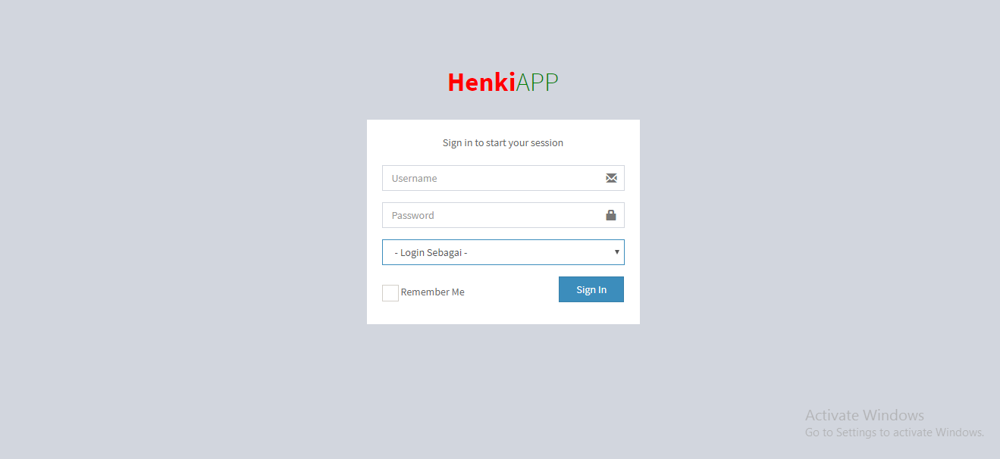
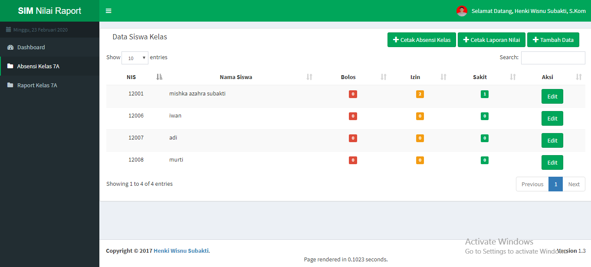
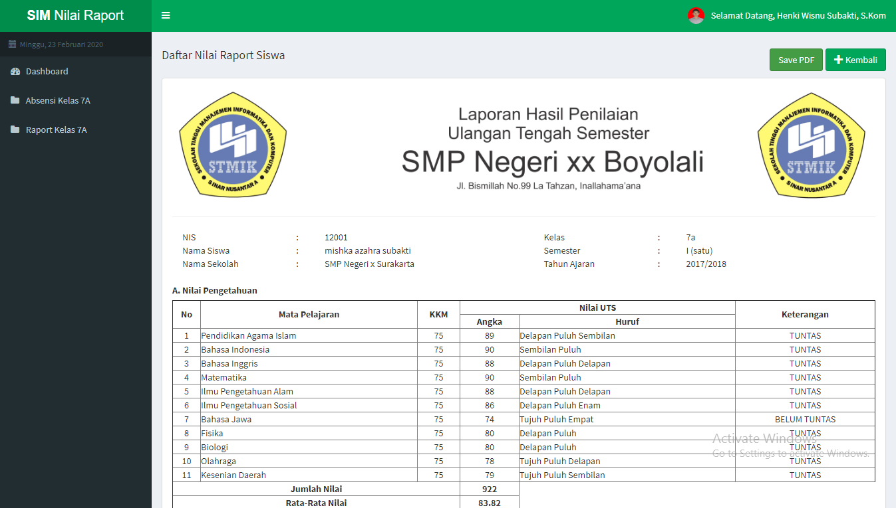

## Aplikasi Pembukuan Nilai Raport

Aplikasi Pembukuan Nilai Raport berbasis web menggunakan Codeigniter dan MySQL. Aplikasi ini saya buat beberapa tahun lalu pertama kali mengenal framework php. Terdapat 2 Role login yaitu sebagai admin atau sebagai guru kelas. Semoga Bermanfaat :)

1. Halaman Login Aplikasi

3. Halaman Absensi

2. Halaman Raport
Dilengkapi dengan fitur simpan ke PDF.

## Cara Instalasi
1. git clone (url) 
2. Import database pulsa.sql

Selamat Mencoba :))